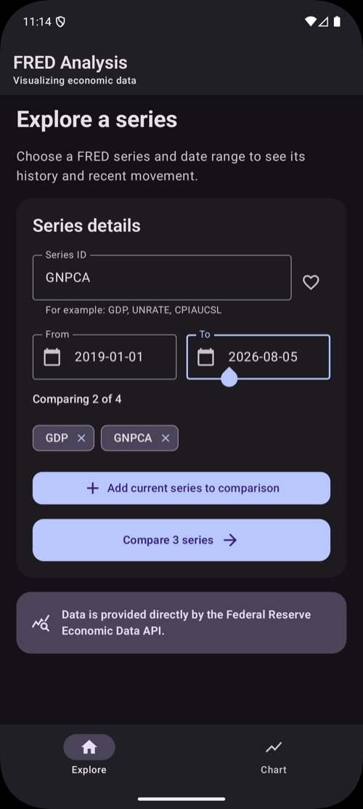
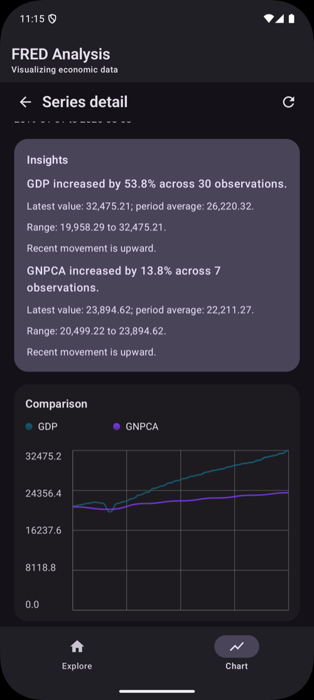

# FRED Analysis

A native Android application to explore US economic data. FRED Analysis pulls time series from the Federal Reserve Bank of St. Louis (FRED) API, lets the user pick any series and date range, and renders the results as an interactive line chart with an auto-generated written summary. It's built independently in Kotlin and Jetpack Compose to leverage production Android patterns: a Hilt-injected MVVM architecture, unidirectional `StateFlow` UI state, coroutine-based concurrency, and caching.

## Screenshots

<!-- Add real device/emulator screenshots here (e.g. in a docs/ folder). Explore + Chart make a strong pair. -->

| Explore | Chart |
|---------|-------|
|  |  |

## Overview

The app is organized around two screens connected by a bottom navigation bar:

- **Explore:** enter a FRED series ID (for example `GDP`, `GNPCA`, `CPIAUCSL`) and a start/end date, add up to four series to compare on one chart, and save series as favorites for quick reuse.
- **Chart:** fetches every selected series, plots them together as a line chart, and shows a written insight per series (net change, period average, range, and recent direction).

## Features

- **Multi-series comparison:** overlay up to four FRED series on a single chart to compare trends
- **Concurrent fetching:** all selected series load in parallel with coroutines (`async`/`awaitAll`) rather than sequentially
- **Auto-generated insights:** each series is summarized in plain language (percent change, average, min/max range, recent movement)
- **Persistent favorites:** starred series are saved across launches via `SharedPreferences`
- **In-memory LRU cache:** a bounded, access-ordered cache avoids re-fetching identical series/date-range requests, with a manual pull-to-refresh that bypasses it
- **Form validation:** series ID and `YYYY-MM-DD` date checks with clear inline errors before a request is made
- **Loading and error states:** network failures surface a friendly retry message instead of crashing
- **Deep-linkable chart route:** the chart is a self-contained navigation destination (`graph/{seriesIds}/{startDate}/{endDate}`) whose inputs are encoded in the route and restored from `SavedStateHandle`, so it survives configuration changes

## Tech Stack

| Layer | Choice |
|-------|--------|
| Language | Kotlin |
| UI | Jetpack Compose, Material 3 |
| Architecture | MVVM, unidirectional `StateFlow` state |
| Dependency injection | Hilt (Dagger) |
| Navigation | Navigation Compose |
| Networking | Retrofit, OkHttp, Gson |
| Concurrency | Kotlin Coroutines |
| Charts | `compose-charts` (ehsannarmani) |
| Min / Target SDK | 28 / 36 |

## Architecture

The app follows MVVM with constructor injection throughout. Composable screens observe immutable UI state from a `ViewModel`, and all data access goes through the `model` layer.

```
com.fred_analysis/
├── MainActivity.kt            # Compose host
├── MainApplication.kt         # @HiltAndroidApp entry point
├── NavWrapper.kt              # Scaffold, bottom nav, and NavHost routes
├── model/
│   ├── FREDApiService.kt      # Retrofit interface + response models
│   ├── RetrofitInstance.kt    # Retrofit/OkHttp/Gson setup (singleton)
│   ├── FavoritesRepository.kt # favorites persisted in SharedPreferences
│   └── FredObservationCache.kt# bounded LRU cache of observations
├── viewmodel/
│   ├── HomeViewModel.kt       # Explore form state, validation, favorites
│   ├── GraphViewModel.kt      # fetch, cache, insight generation
│   └── StartupViewModel.kt    # launch state
└── ui/
    ├── screens/               # HomeScreen, GraphScreen, LaunchScreen
    └── theme/                 # Color, Type, Theme (Material 3)
```

**State flow.** Each `ViewModel` exposes a single immutable `uiState` (`StateFlow`); screens render it and send events back through plain function calls. `GraphViewModel` reads its route arguments from `SavedStateHandle`, so the chart survives configuration changes and process death.

**Data layer.** `GraphViewModel` requests each series concurrently, checks the `FredObservationCache` first, and falls back to the FRED API through `RetrofitInstance`. Results are cached by `(seriesId, startDate, endDate)` in an access-ordered `LinkedHashMap` capped at 12 entries.

**Insights.** After data loads, the ViewModel computes a short natural-language summary (direction, percent change, average, range, and recent trend) so the chart is paired with a readable takeaway.

## Running Locally

1. Open the project in Android Studio (a recent Koala/Ladybug build or newer).
2. Request a free FRED API key (takes a minute) at <https://fred.stlouisfed.org/docs/api/api_key.html>.
3. Add the key to `local.properties` (git-ignored): `fred.api.key=YOUR_KEY`. It is exposed to the app at build time via `BuildConfig.FRED_API_KEY`.
4. Run the `app` configuration on an emulator or device (min SDK 28).

```bash
./gradlew assembleDebug   # build a debug APK
./gradlew installDebug    # install on a connected device/emulator
```

## Credits

Built by **Brian Hu** as an independent project to learn production Android architecture. Economic data provided by the Federal Reserve Bank of St. Louis (FRED). This app is not affiliated with or endorsed by the Federal Reserve.

## License

© 2026 Brian Hu. All rights reserved.
